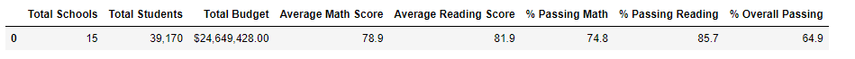
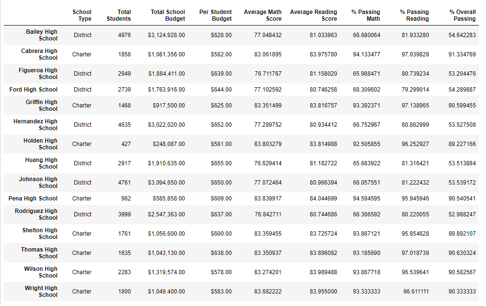
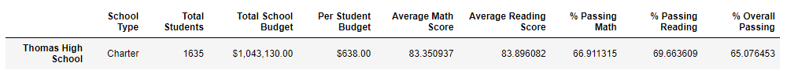
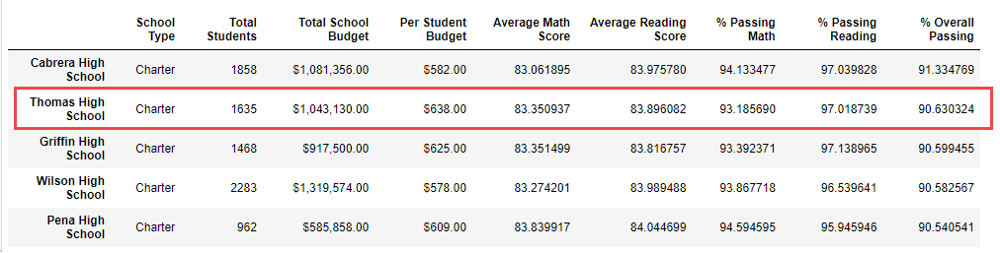

# School_District_Analysis
Python-Panda

## Overview of the school district analysis

This report is to help school board analyze school performance by measuring student average math and reading score, as well as student passing percentages with Python Panda implemented.

## Results

### District Summary
There are overall 64.9% students passing in the 15 schools.

### School Summary

### Thomas High School's 9th grade math/reading impact
Due to the academic dishonesty, Thomas High School 9th's math and reading scores are replaced with NAs. However, this replacement brings the average scores in math, reading, and overall % competitively lower than other schools.

To fairly evaluate the Thomas High School performance, we should re-calculate the average passing% by excluding the THS 9th students from the total students, and this results a better performance to THS, and THS ranks at #2 over the 15 schools after the adjustment.

### Replacing 9th grade impacts (Exclude 9th grade student from total Students)

- No impact to math and reading scores by grade since THS school 9th scores are isolated from the by grade summary, and stay as NA.
- It brings math, reading and overall passing% relatively higher in the bucket "$629-624" based of the school by spending summary.
- It also gives Medium School(1000-2000) better performance on average passing%. 
- It again brings the "Charter" school higher average passing% based on School Type.

## Summary

- The overall passing percentage is increased from 64% to 65% after exclude Thomas High School 9 grades. 
- Thomas High School overall passing is also increased from 65% to 91% after the adjustment.
- Charter schools shows higher performance with 90% overall passing than the district schools 54% overall passing. 
- Schools with less spending shows higher average passing%
- Medium size school has the highest passing percentage with 91%, while small size ranks at #2 with 90%. Large school has the lowest 58% overall passing.

